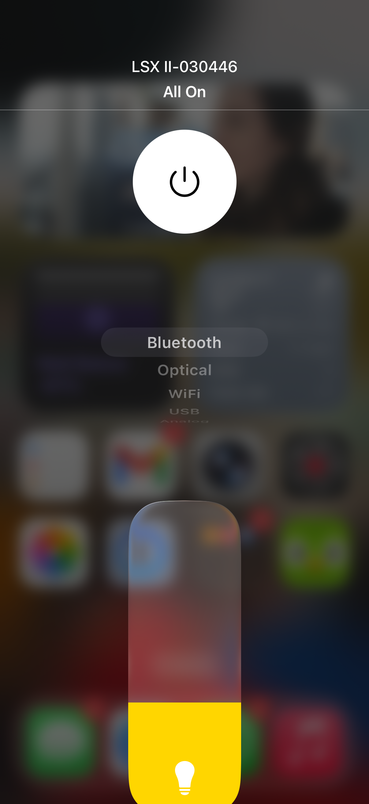

# homebridge-kef-lsx

[](https://www.npmjs.com/package/homebridge-kef-lsx)
[](LICENSE)

Control your KEF wireless speakers with Apple HomeKit via Homebridge.

<p align="center">
  
</p>

## Supported Speakers

- KEF LSX II
- KEF LS50 Wireless II
- KEF LS60

## Features

- **Power control** - Turn speakers on/off
- **Source switching** - WiFi, Bluetooth, HDMI/TV, Optical, USB, Analog
- **Volume control** - Via brightness slider (lightbulb accessory)
- **Auto-discovery** - Speakers found automatically via mDNS

## Installation

### Via Homebridge UI (Recommended)

Search for "KEF" in the Homebridge plugin search and click Install.

### Via Command Line

```bash
npm install -g homebridge-kef-lsx
```

## Configuration

The plugin automatically discovers KEF speakers on your network. Just add the platform to your config:

```json
{
  "platforms": [
    {
      "platform": "KEFSpeaker"
    }
  ]
}
```

### Optional Settings

```json
{
  "platforms": [
    {
      "platform": "KEFSpeaker",
      "autodiscover": true,
      "pollingInterval": 5000,
      "speakers": [
        {
          "name": "Living Room",
          "ip": "192.168.1.100"
        }
      ]
    }
  ]
}
```

| Option | Default | Description |
|--------|---------|-------------|
| `autodiscover` | `true` | Find speakers automatically via mDNS |
| `pollingInterval` | `5000` | State sync interval in milliseconds |
| `speakers` | `[]` | Manual speaker config (fallback if autodiscovery fails) |

## How It Works

Each speaker appears as two accessories in HomeKit:

1. **TV Accessory** - Power button and input source selector
2. **Lightbulb** - Volume control (brightness = volume %)

The lightbulb is a workaround since HomeKit doesn't have a native volume control. "Hey Siri, set KEF volume to 50%" works great!

## Troubleshooting

### Speaker not discovered

1. Ensure your speaker and Homebridge are on the same network/VLAN
2. Try adding the speaker manually with its IP address
3. Check that the speaker's network settings allow local API access

### IP address changes

Set a DHCP reservation in your router so your speaker always gets the same IP.

## License

MIT

